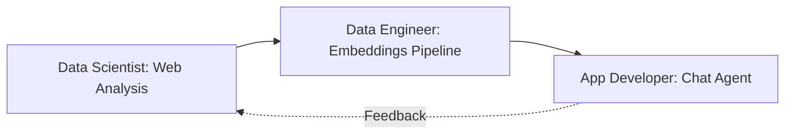

# LangGraph Tutorial: 3-Exercise Team Workshop (Python)

**Duration:** 2-3 hours total (45-60 minutes per exercise)  
**Target:** Intermediate developers learning AI/ML collaboration patterns

This tutorial demonstrates how Data Scientists, Data Engineers, and Application Developers collaborate using LangGraph and AWS Bedrock. Each exercise builds on the previous one, creating a complete AI-powered workflow.

This is a faithful Python port of the JavaScript workshop. It intentionally keeps the TODO-driven scaffolding so each role can complete its section during the exercise.

## Learning Objectives

- **Data Scientists**: Learn to use Python for web data exploration and analysis
- **Data Engineers**: Build embeddings pipelines and populate vector databases
- **Application Developers**: Create chat agents that leverage stored embeddings

## Prerequisites

- Basic Python knowledge
- Python 3.10+
- AWS Account with Bedrock access (Claude/Titan models)
- Git installed

## Quick Setup

```bash
python -m venv .venv
source .venv/bin/activate
pip install -r requirements.txt

cp .env.example .env
# Edit .env with your AWS credentials, or configure AWS CLI credentials.
```

## Exercises Overview

### Exercise 1: Data Science - Web Data Exploration (45 min)

**Role:** Data Scientist  
**Focus:** Data discovery and analysis using Python tools

- Fetch and analyze web content using Python
- Use Python data manipulation patterns similar to pandas/numpy
- Generate insights and prepare data for the engineering pipeline

**Key Skills:** Data exploration, statistical analysis, visualization prep

### Exercise 2: Data Engineering - Embeddings Pipeline (60 min)

**Role:** Data Engineer  
**Focus:** Transform analyzed data into searchable embeddings

- Build LangGraph workflows for data processing
- Generate embeddings using AWS Bedrock
- Store vectors in ChromaDB with metadata
- Implement data quality checks and monitoring

**Key Skills:** ETL pipelines, vector databases, data validation

### Exercise 3: App Development - RAG Chat Agent (45 min)

**Role:** Application Developer  
**Focus:** Build user-facing chat interface

- Create a LangGraph agent with conversation memory
- Implement semantic search using stored embeddings
- Build an interactive chat interface
- Deploy and test the complete system

**Key Skills:** API integration, user experience, system integration

## Collaboration Flow



## Project Structure

```text
data-scientist-engineer-developer-python/
├── README.md
├── QUICKSTART.md
├── requirements.txt
├── .env.example
├── exercise-1-data-science/
│   ├── starter_code.py
│   └── README.md
├── exercise-2-data-engineering/
│   ├── embeddings_pipeline.py
│   ├── data-science-output.json
│   └── README.md
└── exercise-3-app-development/
    ├── chat_agent.py
    ├── server.py
    └── README.md
```

## Time Management Tips

- Do not get stuck on setup. Use the provided scaffolding.
- Focus on core concepts. Skip deep customization.
- Pair programming is encouraged. Different roles can help each other.
- Use TODO comments. Complete marked sections only.

## Success Criteria

By the end of this tutorial, you will have:

1. Working data analysis pipeline (Exercise 1)
2. Populated vector database (Exercise 2)
3. Functional chat agent (Exercise 3)
4. Understanding of role boundaries and collaboration points

## Getting Started

1. Read this README completely.
2. Run the setup commands.
3. Start with Exercise 1, regardless of your primary role.
4. Complete exercises in order because they build on each other.

---

**Ready to start?** Head to `exercise-1-data-science/README.md`.
